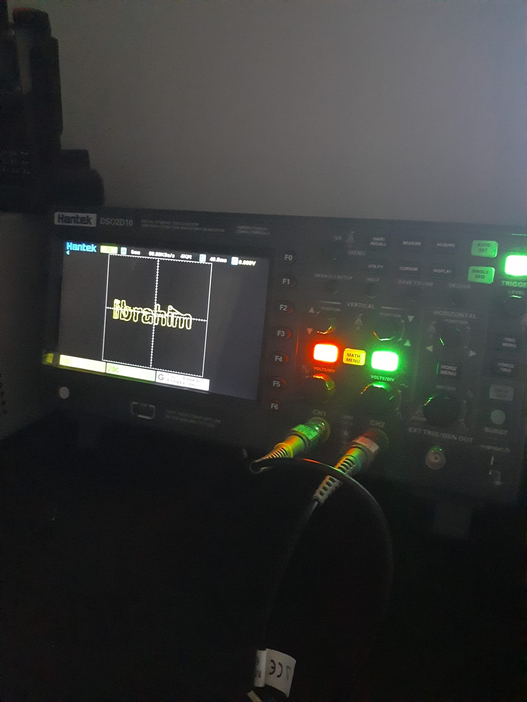
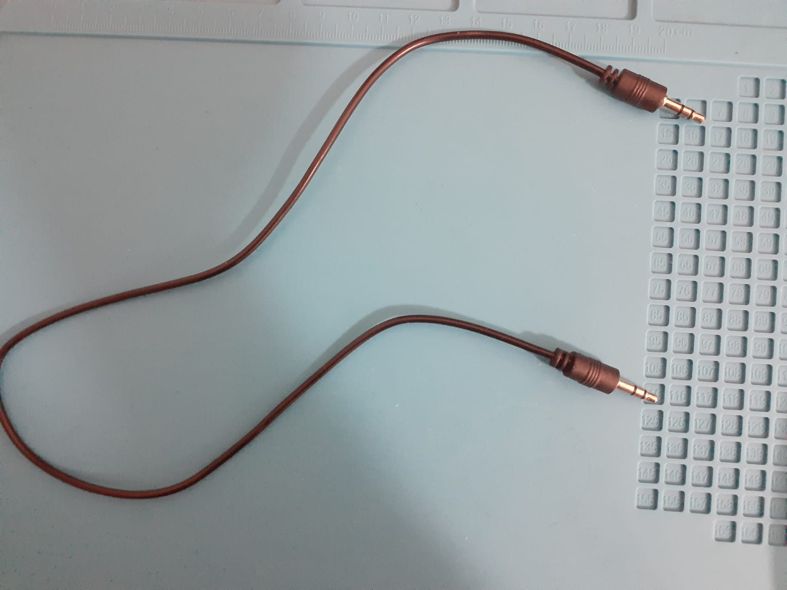
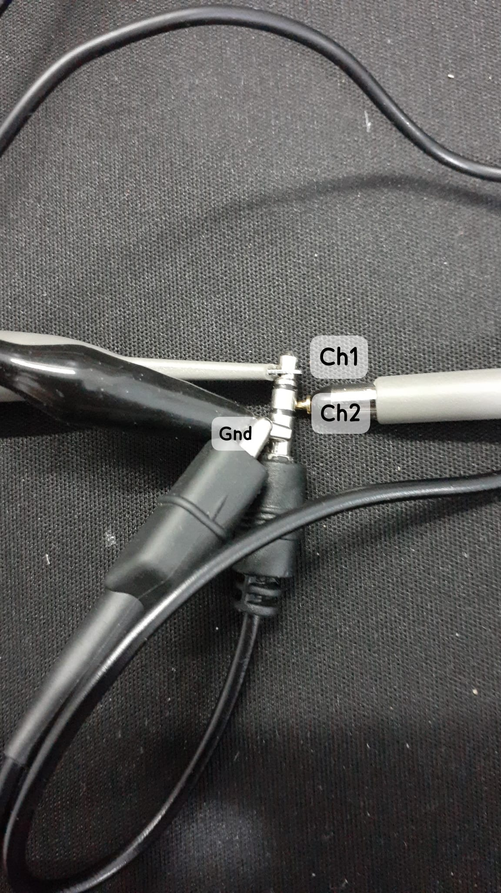
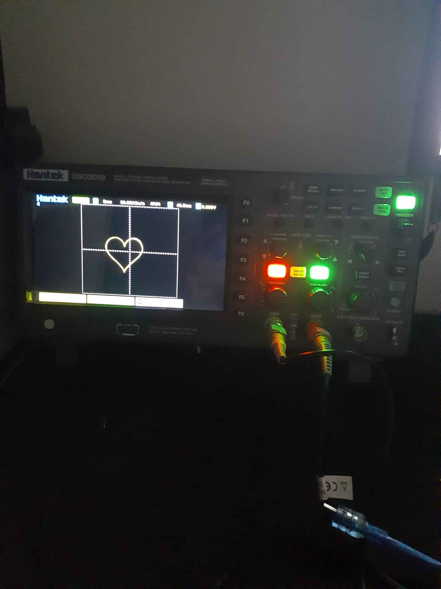

# oscilloscope-art

Draw text and shapes on your oscilloscope screen using XY mode and your PC's audio output.

No extra hardware needed — just an AUX cable and a 3.5mm adapter.



---

## How it works

In XY mode, an oscilloscope uses two input channels as X and Y axes instead of voltage vs. time. By playing a stereo audio file into both channels, you can draw anything on the screen in real time.

---

## Hardware

- Oscilloscope with XY mode (tested on Hantek DSO2D10)
- 3.5mm stereo AUX cable
- 3.5mm to BNC adapter **or** probe clips touching the AUX jack directly



Wiring:
```
AUX Tip   (left)  --> CH1  (X axis)
AUX Ring  (right) --> CH2  (Y axis)
AUX Sleeve        --> GND on both channels
```



---

## Setup

```bash
pip install matplotlib numpy
python oscilloscope_art.py
```

This generates a `.wav` file. Play it from any audio player while your oscilloscope is in XY mode.

**Oscilloscope settings:**
| Setting | Value |
|---------|-------|
| Format | XY |
| CH1 & CH2 | 500 mV/div |
| Time base | 5 ms/div |
| Persistence | Infinite |

---

## Branches

| Branch | What it does |
|--------|-------------|
| `main` | Draws your name as text on the screen |
| `emoji` | Draws shapes — heart, star, smiley face |
| `lyrics` | Scrolls song lyrics phrase by phrase |

### Shapes (emoji branch)



### Lyrics (lyrics branch)

<video src="assets/lyrics_example.mp4" controls width="600"></video>

---

## Contribute your own lyrics

1. Fork this repo
2. Switch to the `lyrics` branch
3. Edit the `LYRICS` list in `oscilloscope_art.py`
4. Open a pull request

If you have a photo or video of it running on your oscilloscope, drop it in the PR — would love to see it!
